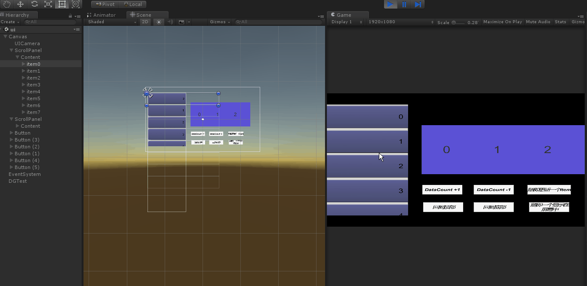

前言
==========
  本工程主要是为了整理和练习ScrollView的各种特效，优化而写。不一定是原创，发现好的会在此写入，自己也会整理，优化，有问题可以联系本人。 
  
 ***
## ScrollView item 动态加载（2108.08.20)
在使用scrollview的时候，items是全部加载到content中的，如果items的数量过多，会造成在打开item的时候卡顿，虽然有剪裁，但是所有的items仍然在内存中，占用大量内存。本实例就是通过动态的加载item，消除因item 量大而造成的卡顿。本实例是在 [zs9024/DataGrid](https://github.com/zs9024/DataGrid) 的基础上进行修改的，如果有侵权，请告知。

### 预览

___***ScrollRect 动态加载***___

***ScrollRect 增删改***  

***ScroolRect 移动到指定位置***
  
###基本思路
  监听ScrollRect的 **onValueChanged**的变化,当变化超过一个Item的size的时候，刷新已经不再显示item的位置。申请的item的数目是显示的item数目 ***+2***，因为在移动很快的时候，会因为其加载不及时而穿帮，需要在上下（或者左右）两个方向都多显示一个item。每次更新都会都会检测，如果item不在显示的范围，会移动到新增的显示范围。
  
### 使用
打开工程，打开Ui_ScrollViewDynamicLoad.unity 场景运行即可。
  
  
### log
* v1.0 克隆GataGrid代码，去掉多余的东西
* V1.2 根据基本思路完成代码，并进行测试（水平和垂直方向)
* v1.3 完成item的增、删、改
* v1.4 完成scroll移动到指定位置，指定item显示在屏幕内。

### 注意
* item的size必须一致，如果不一致，请移步[这](https://github.com/qiankanglai/LoopScrollRect)。
* 不支持多行多列，这是因本人懒！
* 不支持horizontal 和 vertical 共同作用。
### 其他
如果有问题，或者其他修改的，情联系我，907442526@qq.com
  
  
